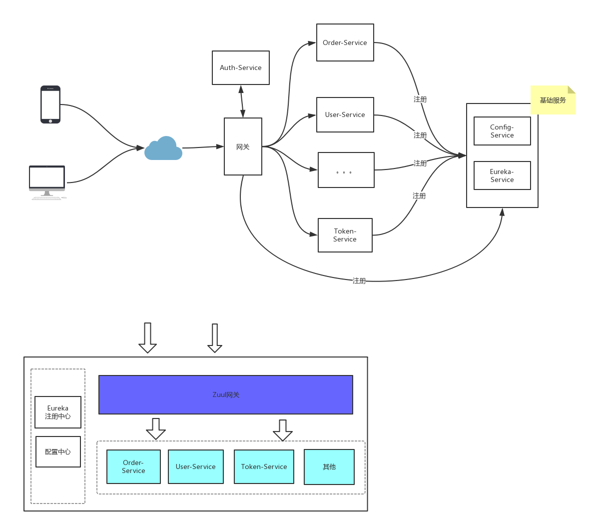
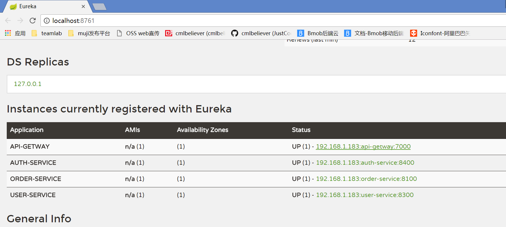
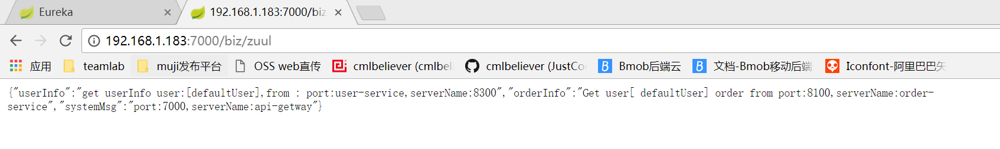
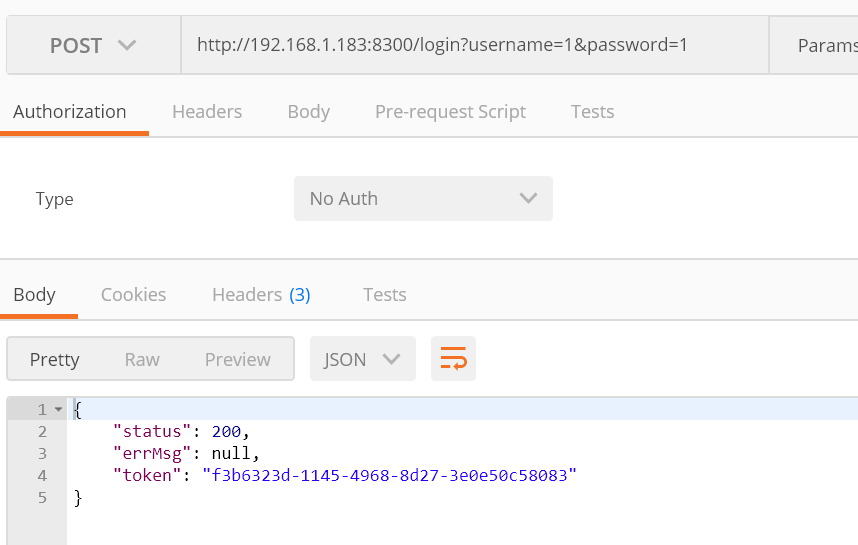
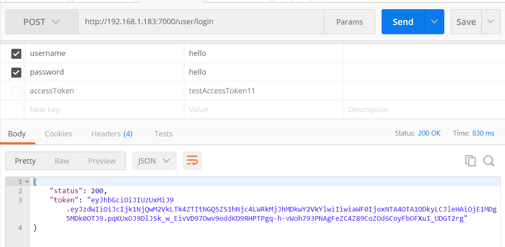

## 工程说明 ##

SpringCloud 研究与学习，内包含Zuul,Eureka,Config,Feign,Ribbon等框架的使用

# 博客资源 #
- [http://blog.csdn.net/cml_blog/article/details/78349703](http://blog.csdn.net/cml_blog/article/details/78349703 "SpringCloud Zuul过滤器返回值拦截")

## 项目内各工程说明 ##
 - common 各服务共通代码
 - config-server 配置中心，作为configserver，端口：9000
 - eureka-server eureka服务工程，端口：8761
 - user-service 用户服务工程
 - auth-service 授权认证服务，用于用户权限校验
 - order-service 订单服务
 - api-getway 网关服务工程，使用Zuul对服务进行分发和权限校验，端口：7000

# 项目结构 #
服务内部调用是互相信任的，可以直接调用。外部访问要通过网关服务进行转发处理。

## 使用说明 ##
 
启动前先安装common工程，进入common工程执行命令：mvn install

 1. 启动配置中心：进入config-server目录执行命令：mvn spring-boot:run
 2. 启动服务中心：eureka-server目录执行命令：mvn spring-boot:run
 3. 启动用户服务：user-service目录执行命令：mvn spring-boot:run
 4. 启动订单服务：order-service目录执行命令：mvn spring-boot:run
 5. 启动授权服务：auth-service目录执行命令：mvn spring-boot:run
 6. 启动网关服务：api-getway目录执行命令：mvn spring-boot:run

步骤1,2需要严格按照顺序启动，步骤1启动成功后才可以继续启动步骤2。步骤2启动成功后，3-6的服务可以同时启动

步骤2启动成功后，访问http://localhost:8761/ 即可查看到启动的服务,全都启动成功后即可以进行后续的测试。

## Api网关说明 ##

 - 页面启动后访问：http://localhost:8761/ 即可查看eureka服务有多少个已经注册成功

 - 网关直接调用用户和订单服务，访问地址：http://192.168.1.183:7000/biz/zuul

 - 用户登录，转发到用户登录接口，返回状态码和token信息，由于token信息是在用户服务中使用的。所以对外使用时在网关层使用JWT加密，防止信息篡改和权限校验。直接调用登录接口：

通过网关调用登录接口，返回的token是通过JWT加密的

## 概论 ##
通常来说，微服务之间的通信是通过内网来的，与外部连接是通过网关来转发的。
所以基本上对外开放的工程都集成在api-getway工程上。通过网关服务，对其他服务调用前可以进行基本的权限校验和数据拦截
 

